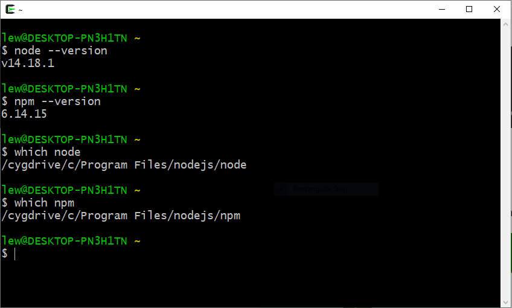

Installera Node.js och npm
===================================

[FIGURE src=/image/snapvt16/nodejs-logo.png class="right"]

Vi skall installera en miljö för JavaScript. Det handlar om Node.js och pakethanteraren npm. Vi ska installea LTS versionen av Node.js, vilket står för Long Term Support och är oftast lite stabilare.

Miljön innebär att du kan köra JavaScript på din dator och du kan ta del av alla de program och paket som erbjuds via pakethanteraren npm.


<!--more-->


Läs mer
-------------------------------

Du kan läsa mer om [Node.js på webbplatsen](https://nodejs.org/).

Du kan läsa mer om [npm på webbplatsen](https://www.npmjs.com/). Där kan du också söka efter de paket som finns publicerade.


Förutsättning
-------------------------------

Du kör Windows, macOS eller en linuxdistribution, du är bekant med terminalen och hur man installerar program.


Installera på Windows (Cygwin, cmd)
-------------------------------

Gå till [nedladdningssidan för Node](https://nodejs.org/en/download/). Ladda ned installationsprogrammet för LTS och installera.

Programmen node och npm läggs till i din PATH automatiskt.

Du kan nu starta programmen från windows-terminalen `cmd` eller ifrån Cygwin. Men starta om din terminal så att den får del av den uppdaterade pathen.

```console
$ node --version
v14.18.1
$ npm --version
6.14.15
```

Så här kan det se ut i Cygwin.



<!--
Du kommer även åt programmen via din Cygwin-terminal, om du har Cygwin installerat.

Öppna din Cygwin-terminal så kan det se ut så här.

[FIGURE src=image/snapvt19/cygwin-node-npm-version.png?w=w3 caption="Node och npm går även att nå från Cygwin."] -->


Installera Windows 10 WSL Debian/Bash
-------------------------------

Även om du har installerat Node på din Windows-maskin, och du använder WSL, så behöver du installera Node/npm i din klient i WSL. Du har då två installationer av Node, en i Windows och en i ditt WSL.

Olika linux-varianter har olika sätt att installera node och npm. Följ instruktionerna på [nedladdningssidan för olika pakethanterare](https://nodejs.org/en/download/package-manager/). Det kan finnas vissa förberedelser som behövs för att du skall kunna installera den senaste versionen, det handlar om vilket repo som apt-get använder för att hämta installationsfilern från. Kolla nedladdningssidan för att vara säker.

Sist jag installerade på WSL Debian/GNU Linux (oktober 2021) så var instruktionen enligt följande.

Först hämtar jag installationsprogrammen, så att pakethanteraren vet vad som skall installeras. Jag behöver vara root när detta görs.

```text
# Using Debian, as root
$ sudo bash
$ curl -sL https://deb.nodesource.com/setup_lts.x | bash -
$ apt install -y nodejs
```

Nu är det installerat. Jag kan nu logga ut som root (`$ exit`) och fortsätta som min vanliga användare.

Jag får eventuellt uppdatera sökvägen, så mitt shell hittar de nyligen installerade binärerna.

```console
$ hash -r
```

Du kan nu starta programmet `node` från din terminal.

```console
$ node --version
v14.18.1
$ which node
/usr/bin/node
```

Jag dubbelkollar att pakethanteraren `npm` fungerar.

```console
$ npm --version
6.14.15
$ which npm
/usr/bin/npm
```

Så här ser det ut på Debian/Linux i WSL i Windows.

[FIGURE src=../img/js-wsl.PNG?w=w3 caption="Nu fungerar Node och npm i WSL."]

<!--
I debian fanns det tidigare ett kommando som hette node, därför installeras vår "node" som nodejs. Men jag vill använda det som node och lägger därför en symbolisk länk till nodejs som jag döper till node.

```bash
$ sudo ln -s $( which nodejs ) /usr/bin/node
```
-->


Installera på Mac OS
-------------------------------

Gå till [nedladdningssidan för Node](https://nodejs.org/en/download/). Ladda ned installationsprogrammet och installera.

Du kan nu starta programmet `node` från din terminal.

```text
which node
node --version
```

Jag dubbelkollar att pakethanteraren `npm` fungerar.

```text
which npm
npm --version
```


Installera på Linux
-------------------------------

Olika linux-varianter har olika sätt att installera node och npm. Följ instruktionerna på [nedladdningssidan för olika pakethanterare](https://nodejs.org/en/download/package-manager/). Det kan finnas vissa förberedelser som behövs för att du skall kunna installera den senaste versionen, det handlar om vilket repo som apt-get använder för att hämta installationsfilern från. Kolla nedladdningssidan för att vara säker.

Sist jag installerade på Debian 11 (oktober 2021) så var instruktionen enligt följande.

```console
# installera progeammet Curl om det behövs
$ sudo apt install curl

# Lägg till Node.js repository i Debian
$ curl -fsSL https://deb.nodesource.com/setup_current.x | sudo -E bash -

# Installera nodejs (och npm)
$ sudo apt install nodejs
```

Du kan nu starta programmet `node` från din terminal.

```console
$ which node
/usr/bin/node
$ node --version
v16.11.1
```

Jag dubbelkollar att pakethanteraren `npm` fungerar.

```console
$ which npm
/usr/bin/npm
$ npm --version
8.0.0
```


Verifiera att Node.js fungerar
-------------------------------

Du kan nu köra JavaScript med node. Pröva följande.

```text
$ node --help
$ node --eval "console.log('Hello World');"
Hello World
```

Du kan också köra node interaktivt och evaluera JavaScript rad för rad. Programmet visar att den är redo för inmatning med prompten `>`.

**NOTERING:** För att få upp prompten i cygwin skall node köras i _interactive mode_. Detta gör du genom att använda kommandot `node -i`.

```console
$ node
> console.log("Hej")
Hej
>
```
<!--
För att få upp prompten i cygwin skall node köras i _interactive mode_. Detta gör du genom att använda kommandot `node -i`.

Så här kan det se ut.

[ASCIINEMA src=91267] -->

Du kan också låta nodejs köra JavaScript-program som finns i filer.

```console
$ echo "console.log('Hello')" > hello.js
$ node hello.js
Hello
```
<!--
Så här kan det se ut.

[ASCIINEMA src=91268]
 -->


Verifiera att npm fungerar
-------------------------------

Se vad du kan göra med npm.

```console
$ npm --help
```


Avslutningsvis
------------------------------

Se till så installationen av node och npm är på sin plats innan du går vidare.
